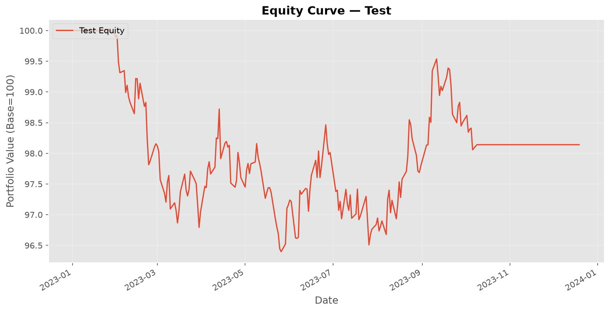
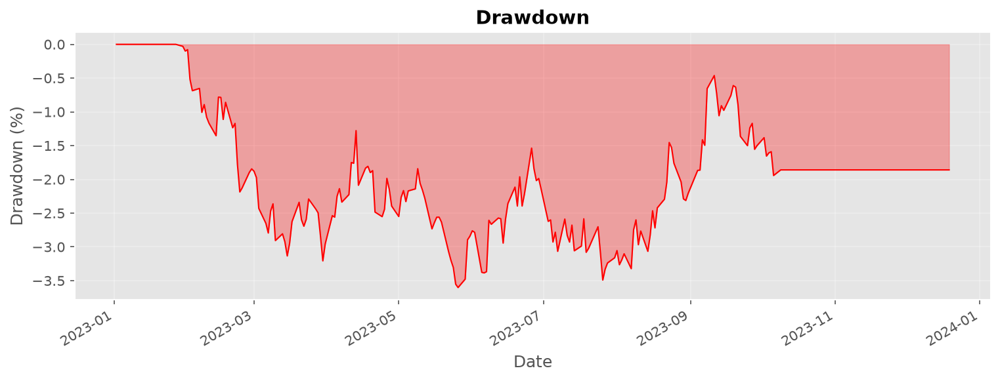
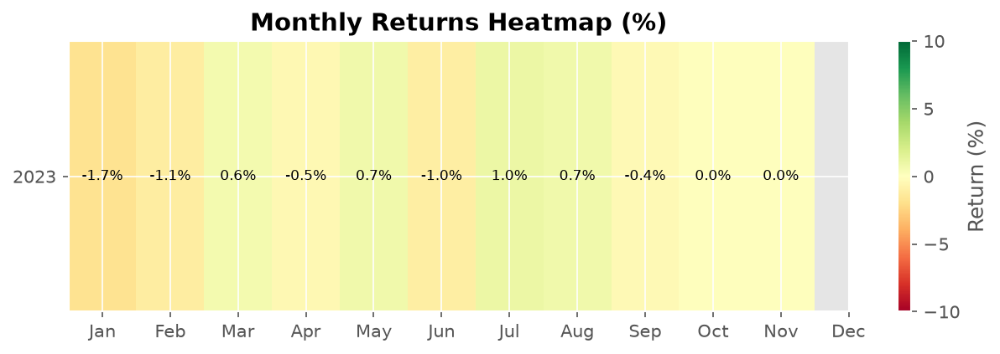

# Backtest Report — Test

**Symbol:** TEST  
**Generated:** 2026-07-01 18:39:40  

---

## Performance Metrics

| Metric | Value |
|--------|-------|
| Total Return | -1.86% |
| Annualized Return | -1.87% |
| Sharpe Ratio | -0.97 |
| Sortino Ratio | -1.40 |
| Max Drawdown | 3.60% |
| Drawdown Duration | 144 days |
| Calmar Ratio | -0.52 |
| Win Rate | 0.00% |
| Profit/Loss Ratio | 0.00 |
| Total Trades | 1 |
| Total P&L | $-18,597.25 |
| VaR (95%) | -0.43% |
| CVaR (95%) | -0.54% |

---

## Charts

### Equity Curve

### Drawdown

### Monthly Returns

---

## Trade List

| Date | Symbol | Direction | Price | Shares | P&L |
|------|--------|-----------|-------|--------|-----|
| 2023-01-30 | TEST | buy | $97.11 | 2059 | $0.00 |
| 2023-10-09 | TEST | sell | $88.26 | 2059 | $-18,597.25 |

---

*Report generated by QuantTradingSystem. Past performance does not guarantee future results.*