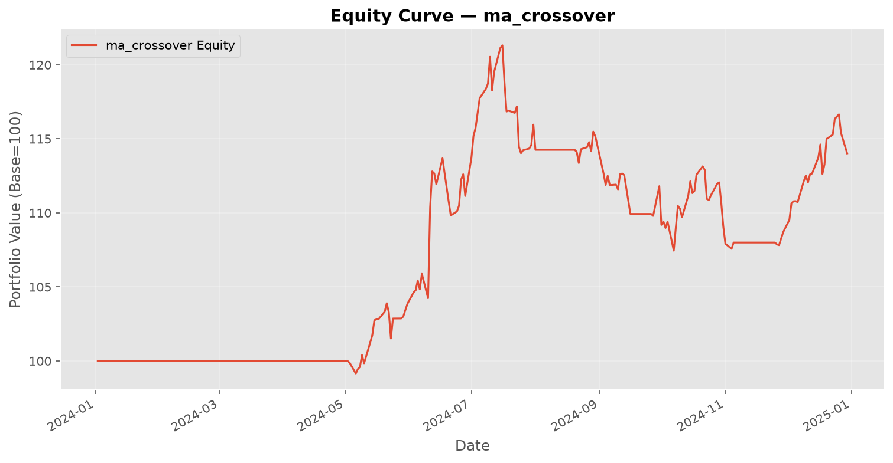
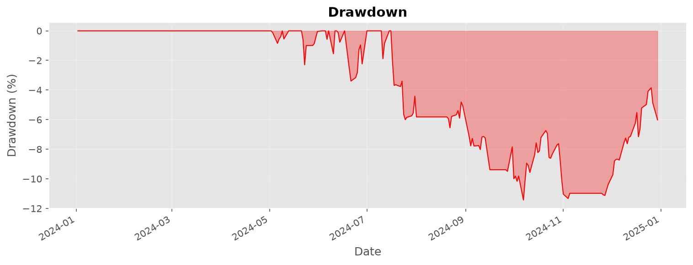
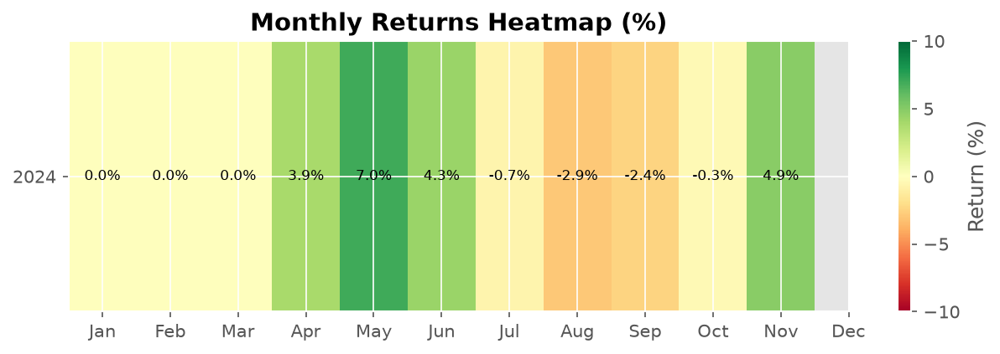

# Backtest Report — ma_crossover

**Symbol:** AAPL  
**Generated:** 2026-07-01 18:50:36  

---

## Performance Metrics

| Metric | Value |
|--------|-------|
| Total Return | 1401.00% |
| Annualized Return | 1407.00% |
| Sharpe Ratio | 0.94 |
| Sortino Ratio | 0.00 |
| Max Drawdown | 1143.00% |
| Drawdown Duration | 0 days |
| Calmar Ratio | 0.00 |
| Win Rate | 6000.00% |
| Profit/Loss Ratio | 3.24 |
| Total Trades | 5 |
| Total P&L | $0.00 |

---

## Charts

### Equity Curve

### Drawdown

### Monthly Returns

---

## Trade List

| Entry Date | Exit Date | Type | Entry Price | Exit Price | Shares | P&L |
|------------|-----------|------|-------------|------------|--------|-----|
| 2024-05-03 | long | entry $181.65 | exit $211.13 | 440 | $12,800.52 |
| 2024-06-13 | long | entry $212.51 | exit $216.38 | 424 | $1,459.11 |
| 2024-08-21 | long | entry $224.83 | exit $214.60 | 406 | $-4,329.64 |
| 2024-09-27 | long | entry $226.21 | exit $221.68 | 388 | $-1,932.07 |
| 2024-11-26 | long | entry $233.68 | exit $250.47 | 369 | $6,016.53 |

---

*Report generated by QuantTradingSystem. Past performance does not guarantee future results.*