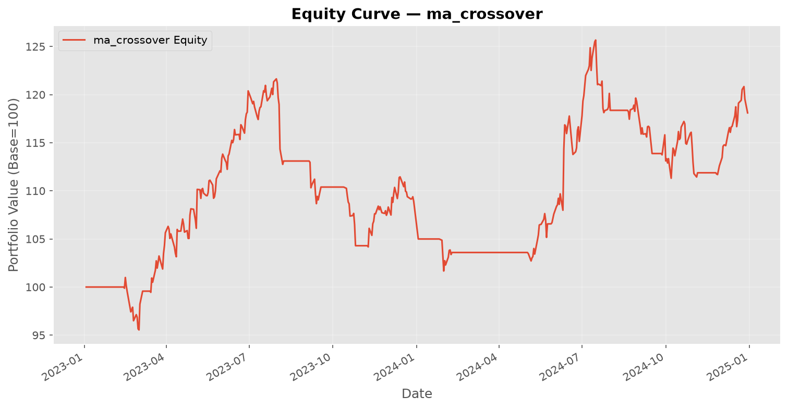
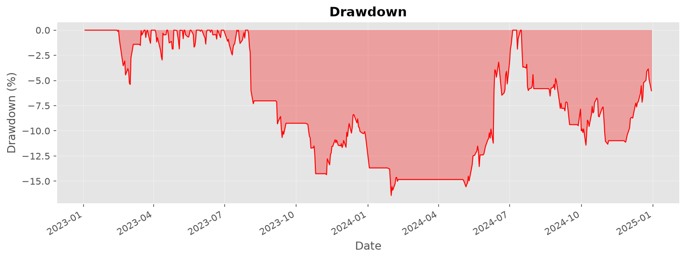
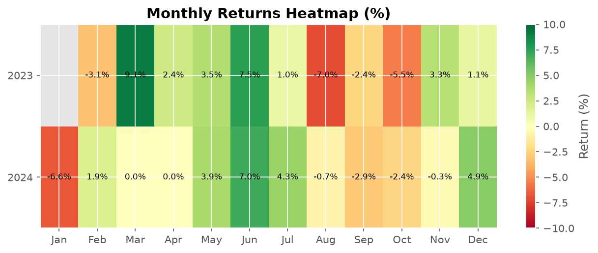

# Backtest Report — ma_crossover

**Symbol:** AAPL  
**Generated:** 2026-07-01 18:54:05  

---

## Performance Metrics

| Metric | Value |
|--------|-------|
| Total Return | 1810.00% |
| Annualized Return | 873.00% |
| Sharpe Ratio | 0.56 |
| Sortino Ratio | 0.00 |
| Max Drawdown | 1642.00% |
| Drawdown Duration | 0 days |
| Calmar Ratio | 0.00 |
| Win Rate | 5385.00% |
| Profit/Loss Ratio | 1.86 |
| Total Trades | 13 |
| Total P&L | $0.00 |

---

## Charts

### Equity Curve

### Drawdown

### Monthly Returns

---

## Trade List

| Entry Date | Exit Date | Type | Entry Price | Exit Price | Shares | P&L |
|------------|-----------|------|-------------|------------|--------|-----|
| 2023-02-14 | long | entry $150.95 | exit $143.03 | 529 | $-4,343.72 |
| 2023-03-02 | long | entry $143.77 | exit $151.42 | 532 | $3,913.89 |
| 2023-03-15 | long | entry $150.74 | exit $174.76 | 528 | $12,510.46 |
| 2023-05-31 | long | entry $174.89 | exit $177.23 | 512 | $1,017.12 |
| 2023-09-06 | long | entry $180.72 | exit $175.66 | 500 | $-2,706.41 |
| 2023-10-16 | long | entry $176.58 | exit $164.72 | 500 | $-6,097.07 |
| 2023-11-09 | long | entry $180.22 | exit $182.10 | 462 | $699.11 |
| 2024-01-29 | long | entry $189.68 | exit $186.88 | 442 | $-1,403.04 |
| 2024-05-03 | long | entry $181.65 | exit $211.13 | 456 | $13,265.99 |
| 2024-06-13 | long | entry $212.51 | exit $216.38 | 439 | $1,510.74 |
| 2024-08-21 | long | entry $224.83 | exit $214.60 | 421 | $-4,489.59 |
| 2024-09-27 | long | entry $226.21 | exit $221.68 | 402 | $-2,001.76 |
| 2024-11-26 | long | entry $233.68 | exit $250.47 | 382 | $6,228.50 |

---

*Report generated by QuantTradingSystem. Past performance does not guarantee future results.*