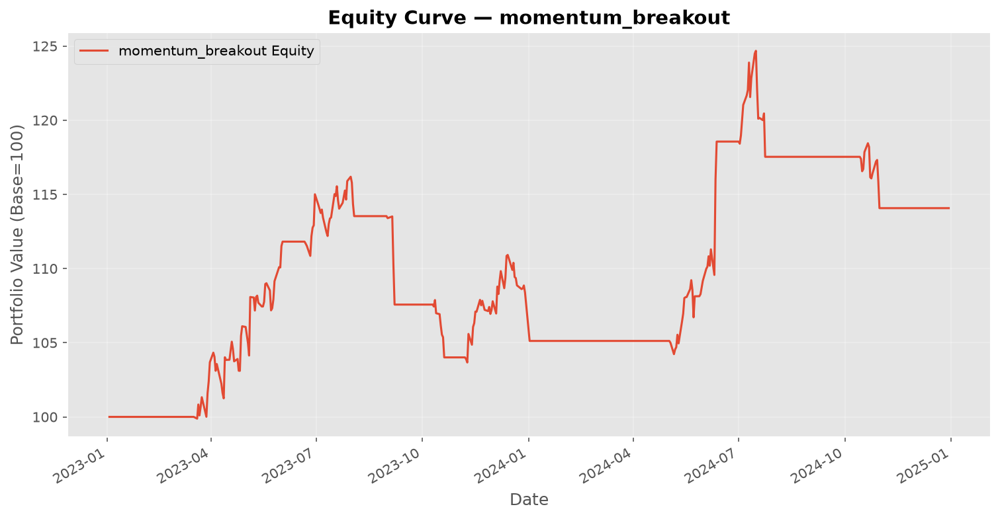
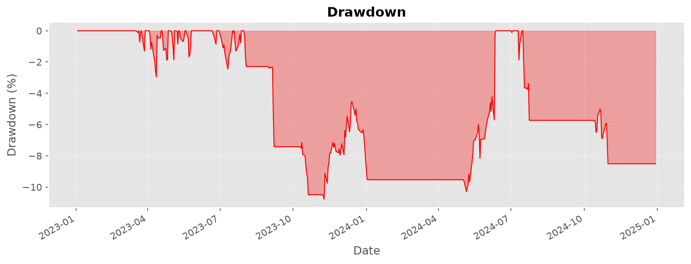
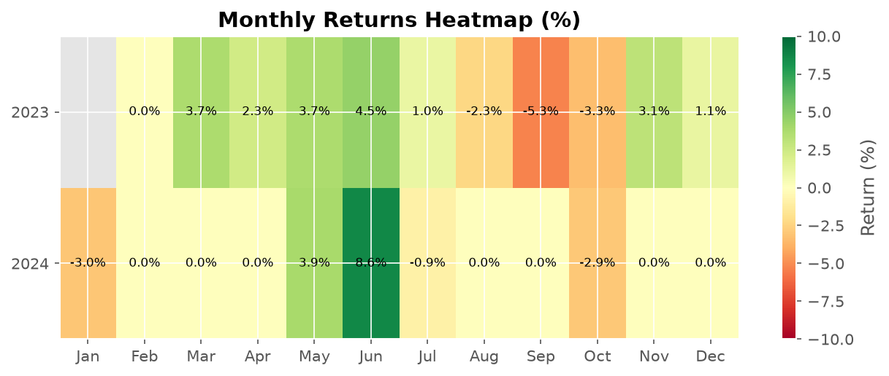

# Backtest Report — momentum_breakout

**Symbol:** AAPL  
**Generated:** 2026-07-01 18:54:13  

---

## Performance Metrics

| Metric | Value |
|--------|-------|
| Total Return | 1407.00% |
| Annualized Return | 685.00% |
| Sharpe Ratio | 0.51 |
| Sortino Ratio | 0.00 |
| Max Drawdown | 1078.00% |
| Drawdown Duration | 0 days |
| Calmar Ratio | 0.00 |
| Win Rate | 5000.00% |
| Profit/Loss Ratio | 2.00 |
| Total Trades | 8 |
| Total P&L | $0.00 |

---

## Charts

### Equity Curve

### Drawdown

### Monthly Returns

---

## Trade List

| Entry Date | Exit Date | Type | Entry Price | Exit Price | Shares | P&L |
|------------|-----------|------|-------------|------------|--------|-----|
| 2023-03-20 | long | entry $155.09 | exit $178.36 | 515 | $11,813.39 |
| 2023-06-22 | long | entry $184.51 | exit $188.43 | 484 | $1,719.64 |
| 2023-09-01 | long | entry $187.19 | exit $175.25 | 485 | $-5,963.05 |
| 2023-10-11 | long | entry $177.64 | exit $170.63 | 484 | $-3,560.28 |
| 2023-11-08 | long | entry $180.70 | exit $183.47 | 460 | $1,109.02 |
| 2024-05-03 | long | entry $181.65 | exit $211.13 | 462 | $13,440.56 |
| 2024-07-02 | long | entry $218.49 | exit $216.55 | 434 | $-1,027.58 |
| 2024-10-15 | long | entry $232.23 | exit $224.12 | 404 | $-3,460.43 |

---

*Report generated by QuantTradingSystem. Past performance does not guarantee future results.*