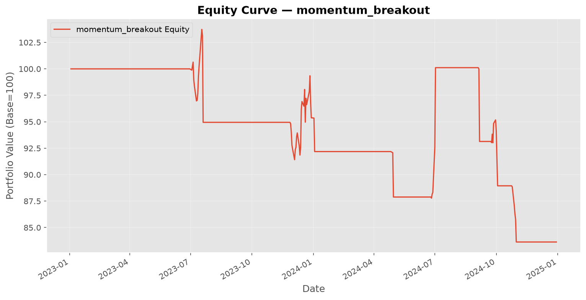
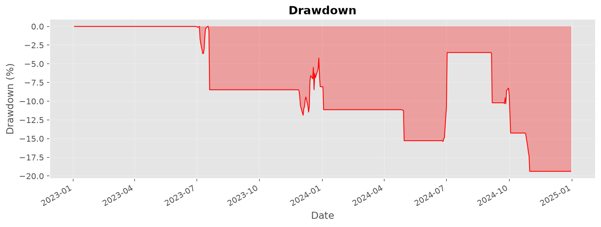
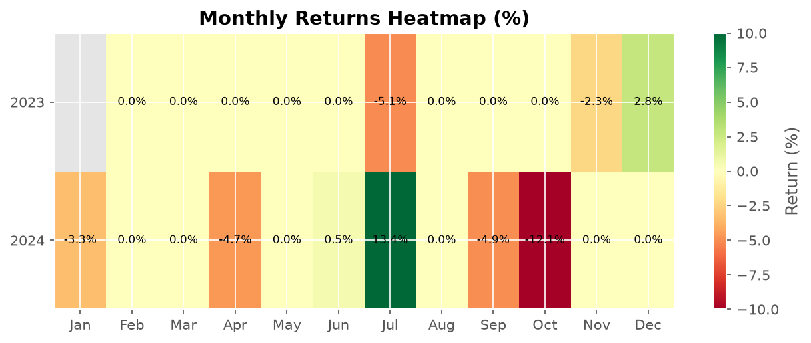

# Backtest Report — momentum_breakout

**Symbol:** TSLA  
**Generated:** 2026-07-01 18:54:44  

---

## Performance Metrics

| Metric | Value |
|--------|-------|
| Total Return | -16.36% |
| Annualized Return | -8.60% |
| Sharpe Ratio | -0.78 |
| Sortino Ratio | 0.00 |
| Max Drawdown | 19.37% |
| Drawdown Duration | 0 days |
| Calmar Ratio | 0.00 |
| Win Rate | 14.29% |
| Profit/Loss Ratio | 0.43 |
| Total Trades | 7 |
| Total P&L | $0.00 |

---

## Charts

### Equity Curve

### Drawdown

### Monthly Returns

---

## Trade List

| Entry Date | Exit Date | Type | Entry Price | Exit Price | Shares | P&L |
|------------|-----------|------|-------------|------------|--------|-----|
| 2023-07-03 | long | entry $279.96 | exit $262.77 | 285 | $-5,054.22 |
| 2023-11-28 | long | entry $246.84 | exit $238.33 | 307 | $-2,762.31 |
| 2024-04-29 | long | entry $194.15 | exit $183.19 | 379 | $-4,296.35 |
| 2024-06-26 | long | entry $196.47 | exit $231.14 | 357 | $12,226.74 |
| 2024-09-05 | long | entry $230.29 | exit $210.62 | 347 | $-6,975.17 |
| 2024-09-24 | long | entry $254.40 | exit $240.54 | 292 | $-4,190.90 |
| 2024-10-25 | long | entry $269.32 | exit $249.73 | 264 | $-5,311.30 |

---

*Report generated by QuantTradingSystem. Past performance does not guarantee future results.*