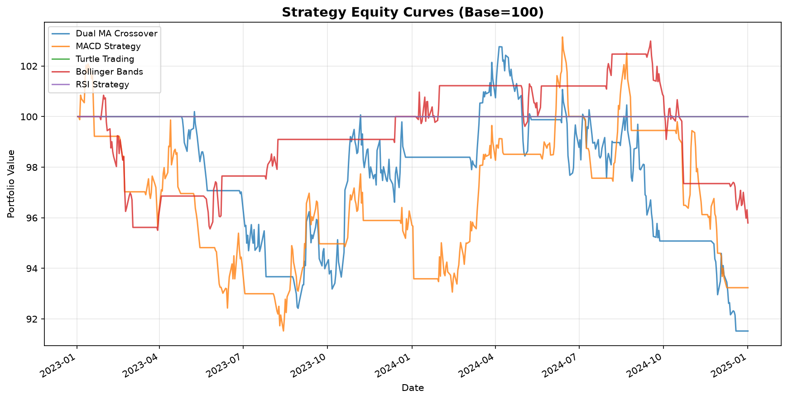
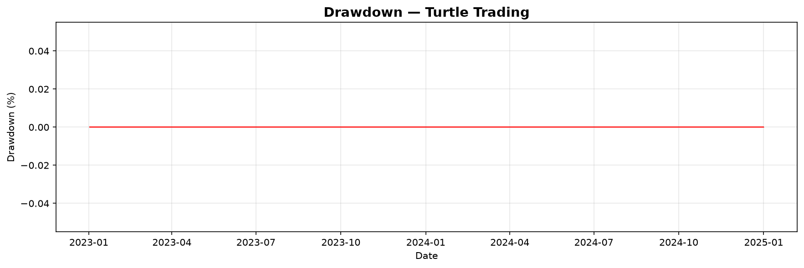

# Quantitative Trading System — Backtest Report

**Period:** 2023-01-01 to 2025-01-01  
**Initial Capital:** $1,000,000  
**Risk-Free Rate:** 2.0%  

## Strategy Performance

| Strategy | Return | Sharpe | Max DD | Trades | Win Rate |
|----------|--------|--------|--------|--------|----------|
| Dual MA Crossover | -8.48% | -0.870 | 10.94% | 7 | 28.6% |
| MACD Strategy | -6.76% | -0.696 | 10.34% | 20 | 25.0% |
| Turtle Trading | 0.00% | 0.000 | 0.00% | 0 | 0.0% |
| Bollinger Bands | -4.20% | -0.850 | 6.98% | 10 | 60.0% |
| RSI Strategy | 0.00% | 0.000 | 0.00% | 0 | 0.0% |

**Average Annual Return:** -1.94%

---
*Past performance does not guarantee future results.*
